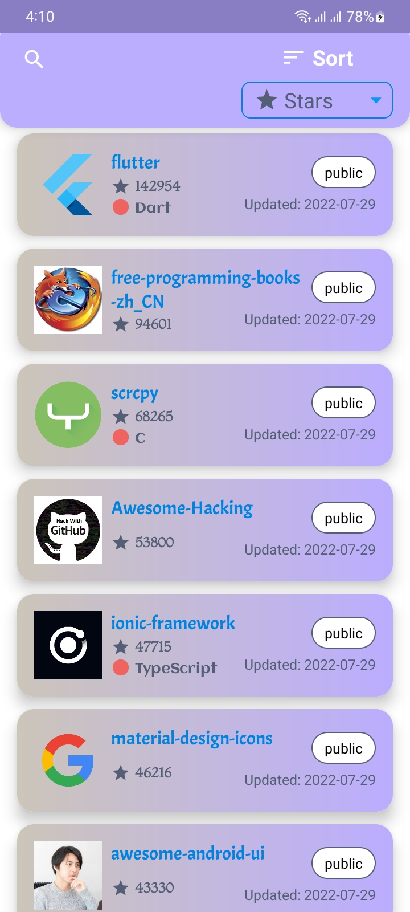
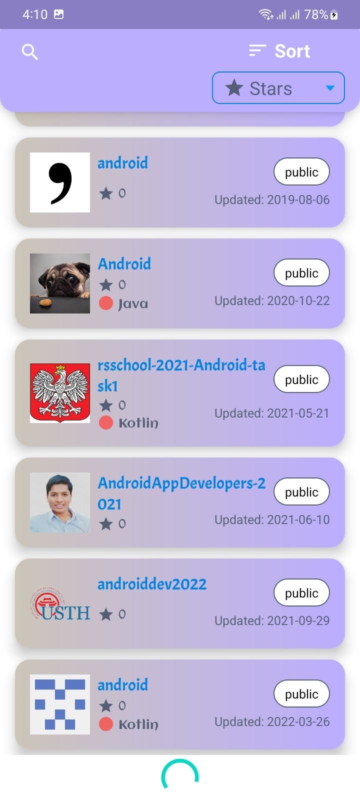
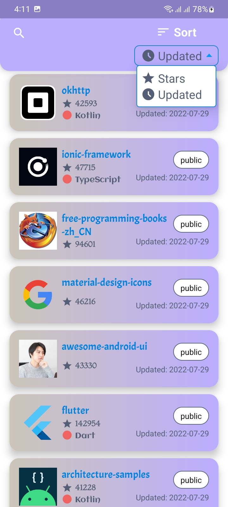
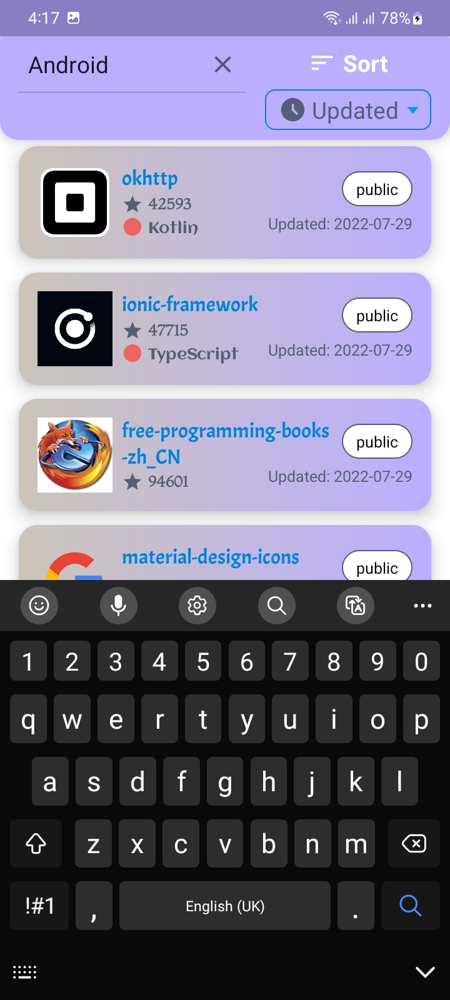
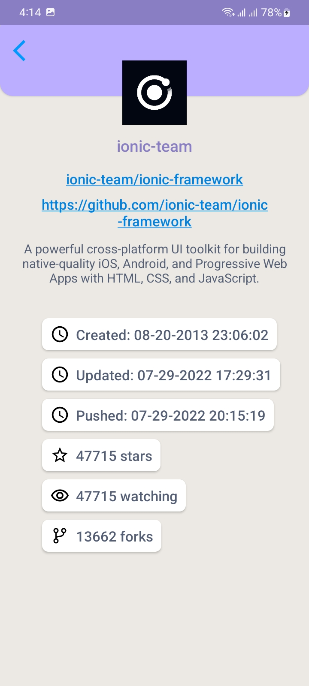
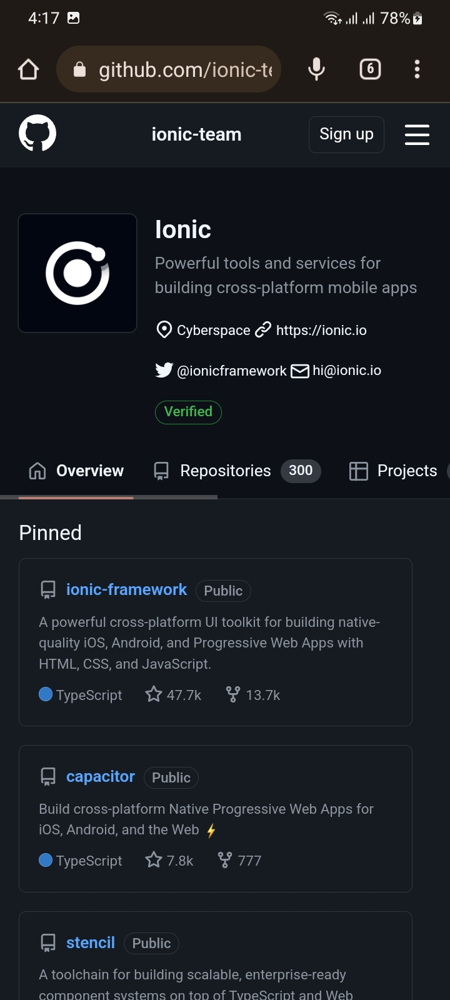

# GitView

In short, this GitView Projects main feature is it search GitHub repositories with a specific query and show the results and its full details.

## Features

- Shows all the repository related to a specific keyword.
- Offline access to data.
- List can be sorted based by repository stars count or updated time.
- Full details of repositories.
- Reposity link or owner page can be visited.
- A search mechanism has been added for different key search. But not fully done.

## Design Pattern & Architectures
- The full Model—View—ViewModel (MVVM) Pattern has been used.
- Dagger Hilt has been used for Dependency Injection.
- For API calling Retrofit2 has been used.
- API BASE_URL & END_POINTS are securely saved in BuildConfig.
- Central & manual access_token system is added for token based API (Just the structure has been made).
- Retry mechanism has been added when the API fails. And it retries for maximum 3 times.
- New Refreshed data is being fetched every 30 minutes. For that periodic Thread has been used.
- Room Database with SQL is used for Local Database.
- Repository pattern used with Retrofit2 & Room Database.
- Repository list is paginated by scrolling. It fetch 10 new data on last scroll.
- App's flavor has been added for different build types.
## Screenshots

## Future Scope

- I made a search mechanism but couldn't finish due to lack of time. It can be implemented for other queries.
- For pagination It's better to use Paging 3. To finish the project in time I have used manual pagination.
## 🚀 About Me
I'm a Android Developer...

## 🔗 Links

